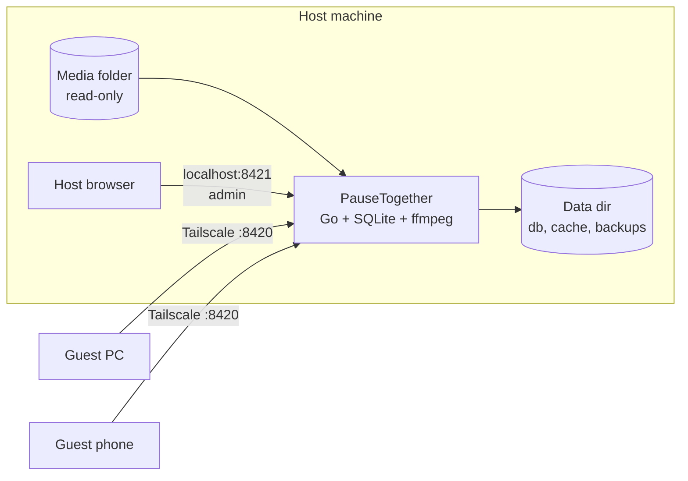

<div align="center">

# PauseTogether

*Distance can't pause us.*

A self-hosted watch-together app. Same show. Same second. Different places.

[Features](#features) • [How it works](#how-it-works) • [Getting started](#getting-started) • [Development](#development)

</div>

One machine serves its own video library. Friends reach it over [Tailscale](https://tailscale.com) and
watch in sync from PCs, tablets and phones. When one of them buffers or steps away, the room waits.

## Features

- **Your library, Plex-style.** Movies, TV shows and other videos, read from local folders with Plex
  naming. New files are picked up on their own.
- **Original quality.** Video is never re-encoded. Each video is prepared once into a plain MP4, so
  seeking just works.
- **Real sync.** The server owns the room's state. Every player follows it, with small speed nudges
  for small drift.
- **The room waits for everyone.** Someone buffering, or away for more than 3 s, pauses the room.
  Anyone can press "Play anyway".
- **Subtitles.** Embedded and sidecar text subtitles, converted to WebVTT, with a shared time offset.
  Old Turkish, Western and Cyrillic `.srt` files decode correctly.
- **Chat.** One chat per room, with replies and video timestamps. It stays visible in fullscreen.
- **No accounts.** Guests pick a name. The host manages everything else from a local-only admin page.
- **Works on phones.** Plays inline on iPhone, with its own controls and fullscreen.

## How it works



- One Go binary with the SvelteKit app built in, running in Docker.
- Two ports. The **guest port** (`8420`) serves the app. The **admin port** (`8421`) adds the admin
  API and only listens on `127.0.0.1`.
- Tailscale is the only access control. Anyone who reaches the guest port is trusted.

> [!IMPORTANT]
> Every viewer streams the original file. The host's upload speed must cover the video's bitrate
> times the number of guests.

## Getting started

### Prerequisites

- Linux host with [Docker](https://docs.docker.com/engine/install/) and Docker Compose
- [Task](https://taskfile.dev/installation/)
- [Tailscale](https://tailscale.com/download) on the host and on every guest device

### Setup

1. Clone the repo and copy the settings template:

   ```sh
   git clone https://github.com/erkanvatan/pause-together.git
   cd pause-together
   cp .env.example .env
   ```

2. Edit `.env`:

   | Variable | What it is | Default |
   | --- | --- | --- |
   | `MEDIA_ROOT` | Folder with all your media. Mounted read-only. Must exist. | `~/Videos` |
   | `DATA_DIR` | Folder for the database, cache and backups. `task up` creates it. | `~/.local/share/pausetogether` |
   | `PUBLIC_BIND` | Host IP for the guest port. Set it to your Tailscale IP. | `127.0.0.1` |
   | `GUEST_PORT`, `ADMIN_PORT` | Host ports. | `8420`, `8421` |

   > [!CAUTION]
   > Never set `PUBLIC_BIND` to `0.0.0.0`. Docker bypasses `ufw`, so that opens the app on every
   > network the host joins, café Wi-Fi included.

3. Let Docker bind the Tailscale IP even when it starts before Tailscale does:

   ```sh
   echo 'net.ipv4.ip_nonlocal_bind=1' | sudo tee /etc/sysctl.d/99-pausetogether.conf
   sudo sysctl --system
   ```

4. Start Docker at boot, so PauseTogether comes back by itself after a restart:

   ```sh
   sudo systemctl enable docker.service containerd.service
   ```

5. Build and start:

   ```sh
   task up
   ```

   It keeps running across reboots until you stop it with `task down`. After that, it stays off
   until the next `task up`.

6. Open `http://localhost:8421` on the host. Go to the admin page and add a library: a folder under
   your media root, plus its type.

7. Give guests one address, for example `http://<tailscale-ip>:8420`. Stick to one: the Tailscale IP
   and the MagicDNS name each give a guest a different identity.

> [!TIP]
> `task logs` follows the server log. `task down` stops the server, so check nobody is mid-movie.

### Naming your files

PauseTogether reads everything from folder and file names. It never looks anything up online, so the
names have to be right. Movies and TV shows follow [Plex's naming rules](https://support.plex.tv/articles/naming-and-organizing-your-movie-media-files/).
A file that doesn't match is skipped and shows up on the admin page with the reason.

#### Libraries

A library is one folder inside `MEDIA_ROOT` with one type: **Movies**, **TV Shows** or
**Other Videos**. Keep each type in its own folder:

```text
~/Videos/            ← MEDIA_ROOT
├── Movies/          ← library, type Movies
├── TV/              ← library, type TV Shows
└── Home Videos/     ← library, type Other Videos
```

Libraries can't overlap. You can't add `~/Videos` as one library and `~/Videos/Movies` as another.

#### Movies

The file name needs the title and the year in parentheses. The folder is optional, and only the file
name counts.

```text
Movies/
├── Dune (2021)/
│   ├── Dune (2021).mkv
│   ├── Dune (2021).en.srt
│   └── Trailers/                          ← extras: skipped quietly
├── Heat (1995).mkv                        ← no folder: fine
└── Alien Collection/                      ← collection folder: fine
    └── Alien (1979)/Alien (1979).mkv
```

- **Editions:** `Blade Runner (1982) {edition-Final Cut}.mkv`. Two editions can share a folder.
- **Versions:** text after the year is a version label: `Dune (2021) - 4K.mkv`.
- **Other `{...}` tags** are ignored, like `{imdb-tt1160419}`.

#### TV shows

Every episode sits in a show folder. The show's name comes from that folder, not from the file. The
season and episode come from the `s01e02` in the file name.

```text
TV/
└── Severance (2022)/                      ← show folder: the show's name
    ├── Season 01/
    │   ├── Severance (2022) - s01e01 - Good News About Hell.mkv
    │   └── Severance (2022) - s01e02 - Half Loop.mkv
    ├── Season 2/                          ← no leading zero: fine
    │   └── Severance - s02e01.mkv         ← year and episode title are optional
    └── Specials/                          ← or Season 00
        └── Severance - s00e01 - Inside Lumon.mkv
```

- **Season folders are optional.** An episode can sit loose in the show folder.
- **Two episodes in one file:** `s01e01-e02`, `s01e01e02` or `s01e01-02`.
- **Episode titles** come after ` - `. Junk after the episode number (`.1080p.BluRay-GROUP`) is ignored.
- **One level only.** `Show/Season 01/Disc 1/…` is skipped. So is an episode with no show folder.

> [!WARNING]
> Episodes named by date (`Show - 2024-05-01.mkv`) or by absolute number (`Show - 125.mkv`, common for
> anime) are not supported. Rename them to `s01e02` style.

#### Other videos

No rules. The file name is the title, and sub-folders become groups in the picker.

```text
Home Videos/
├── Wedding.mp4                            ← title "Wedding", no group
└── Summer 2024/
    └── Beach Day.mov                      ← title "Beach Day", group "Summer 2024"
```

#### Subtitle files

A subtitle file (`.srt`, `.vtt` or `.ass`) sits next to its video. Its name is the video's name, then
a language code, then optional flags.

```text
Dune (2021).mkv
Dune (2021).en.srt                         ← English
Dune (2021).tur.srt                        ← Turkish: 2- or 3-letter codes both work
Dune (2021).en.forced.srt                  ← forced: only the foreign-language parts
Dune (2021).en.sdh.srt                     ← for the deaf and hard of hearing (.hi works too)
```

- **The language code is required.** `Dune (2021).srt` is skipped.
- **No `Subs/` folder.** Subtitles in a sub-folder aren't read.
- **`hi` means two things.** First it's Hindi (`.hi.srt`). After a language it's the SDH flag
  (`.en.hi.srt`).

Subtitles inside the video file need no naming. They're found on their own.

#### Skipped files

These never show up in the picker:

| Skipped | Examples | On the admin page? |
| --- | --- | --- |
| Extras and samples (Movies and TV only) | `Trailers/`, `Featurettes/`, `Dune (2021)-trailer.mkv`, `sample.mkv` | No |
| Hidden and macOS files | `.hidden.mkv`, `._Dune (2021).mkv` | No |
| Movies split into parts | `Dune (2021) - pt1.mkv`, `cd1`, `disc1` | Yes |
| Anything that breaks the rules above | `Dune.mkv` in a Movies library | Yes |

> [!NOTE]
> Renaming or moving a file makes it a new video, and the old one counts as missing. A room using the
> old one shows "Video missing" once its prepared copy is gone too. Pick the new file there, and
> playback resumes where it was.

### Supported formats

| | Supported |
| --- | --- |
| Containers | `.mkv .mp4 .m4v .mov .avi .webm .ts .m2ts` |
| Video | H.264 (8-bit 4:2:0), HEVC, AV1, VP9. Each device plays what it can decode. |
| Audio | Any. Converted to stereo AAC unless it's already AAC with up to two channels. |
| Subtitles | Text only: SRT, ASS, WebVTT, mov_text. Image subtitles (PGS, VobSub) are not. |

## Development

Everything runs in Docker through Task. You don't need Go or Node on the host.

```sh
task dev        # dev stack with hot reload: http://localhost:5173
task test       # all unit tests (Go + web)
task lint       # golangci-lint, svelte-check
task build      # build the production image
```

Dev uses its own ports and data folder (`./.dev-data`), so it runs safely next to production. It
needs `MEDIA_ROOT` or `DEV_MEDIA_ROOT` set in `.env`. Point `DEV_MEDIA_ROOT` at a scratch folder when
testing file adds and deletes.

**Stack:** Go standard library, SQLite ([modernc.org/sqlite](https://gitlab.com/cznic/sqlite)),
[coder/websocket](https://github.com/coder/websocket), ffmpeg. SvelteKit (Svelte 5, SPA mode) and
Tailwind v4.

The full spec lives in [CLAUDE.md](CLAUDE.md). The build order lives in [docs/plan.md](docs/plan.md).
